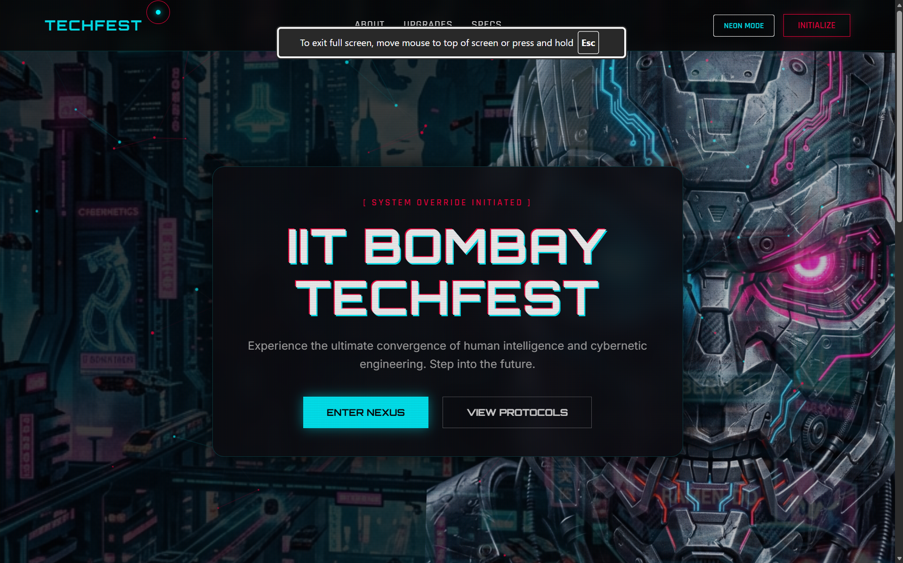

# IIT Bombay Techfest - Campus Ambassador Project 🤖

> **Live Deployment:** [ca-iitbtechfest.pages.dev](https://ca-iitbtechfest.pages.dev/)

A highly immersive, fully responsive landing page designed and developed for the IIT Bombay Techfest Campus Ambassador program. Built with a heavy emphasis on modern UI/UX design, this project features a dark, neon-lit "Cyborg/Cyberpunk" aesthetic.

## 🚀 Key Features

- **Boot Sequence Protocol:** A terminal-style loading screen that builds suspense before revealing the full interface.
- **Dynamic HUD Dashboard:** A complex, glowing 3D-like Heads-Up Display featuring animated progress bars, a spinning radar, and a fast-scrolling live data feed.
- **Interactive 3D Elements:** Vanilla JS powered magnetic card tilt effects that track mouse movement in 3D space.
- **Custom Cyber Cursor:** A custom-built glowing cursor with a trailing outline that reacts to hover states across the interface.
- **Scroll Reveal Animations:** Smooth, staggered animations trigger as elements enter the viewport.
- **Theme Override System:** A toggle button allowing users to switch between "STEALTH MODE" (high-contrast dark overlay) and "NEON MODE" (exposing the chaotic background).
- **Responsive Architecture:** Flawless scaling across desktops, tablets, and mobile devices without relying on external CSS frameworks.

## 🛠️ Technology Stack

Built purely with core web technologies to ensure maximum performance and complete control over the custom animations:

- **HTML5:** Semantic structure and custom layout grids.
- **CSS3 (Vanilla):** Glassmorphism, CSS variables for theming, keyframe animations, and flexbox/grid layouts.
- **Vanilla JavaScript:** Intersection Observers, 3D math for tilt effects, dynamic DOM manipulation for data streams, and canvas background animations.

## 📸 Preview

---
*Created as part of the IIT Bombay Techfest Campus Ambassador initiative.*
